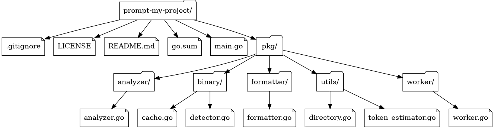

# Prompt My Project (PMP)

<div align="center">
  
</div>

<div align="center">
  <a href="https://github.com/benoitpetit/prompt-my-project/blob/master/LICENSE">
    
  </a>
  
  
  
  <a href="https://liberapay.com/devbyben/donate">
    
  </a>
</div>

<p align="center">
  <strong>Transform your codebase into AI-ready prompts and visual dependency graphs</strong><br>
  Prompt My Project (PMP) is a powerful command-line tool that analyzes your source code<br>
  and generates structured prompts optimized for AI assistants like ChatGPT, Claude, and Gemini.
</p>

<p align="center">
  <a href="#quick-start">Quick Start</a> •
  <a href="#installation">Installation</a> •
  <a href="#usage-guide">Usage Guide</a> •
  <a href="#examples">Examples</a> •
  <a href="#advanced-features">Advanced Features</a>
</p>

## Quick Start

### TL;DR - Get started in 30 seconds

```bash
# Install PMP
go install github.com/benoitpetit/prompt-my-project@latest

# Generate a prompt for your current project
pmp prompt . --format stdout:txt

# Generate a dependency graph
pmp graph . --format dot
```

### What PMP does for you

- **🤖 AI-Ready Prompts**: Converts your codebase into structured prompts perfect for ChatGPT, Claude, and other AI assistants
- **📊 Visual Dependency Graphs**: Creates beautiful dependency graphs in multiple formats (DOT, JSON, XML, TXT)
- **🔧 Smart Filtering**: Automatically excludes binary files, respects .gitignore, and allows custom patterns
- **⚡ High Performance**: Parallel processing with configurable workers and intelligent file size limits
- **📝 Multiple Formats**: Supports TXT, JSON, XML output with stdout piping capabilities

## Installation

### Option 1: Go Install (Recommended)

```bash
go install github.com/benoitpetit/prompt-my-project@latest
```

### Option 2: Installation Script

```bash
curl -fsSL https://raw.githubusercontent.com/benoitpetit/prompt-my-project/master/scripts/install.sh | bash
```

### Option 3: Download Binary

Download the latest binary from the [releases page](https://github.com/benoitpetit/prompt-my-project/releases)

### Verify Installation

```bash
pmp --help
```

If you see the help message, you're ready to go! 🎉

## Usage Guide

### Basic Commands

| Command | Description | Example |
|---------|-------------|----------|
| `pmp` | Show help and available commands | `pmp --help` |
| `pmp prompt` | Generate AI-ready prompts | `pmp prompt .` |
| `pmp graph` | Generate dependency graphs | `pmp graph .` |
| `pmp completion` | Generate shell completions | `pmp completion bash` |

### 1. Generate Project Prompts

#### Basic Usage
```bash
# Generate prompt for current directory
pmp prompt .

# Generate prompt for specific project
pmp prompt /path/to/project

# Output to stdout (for piping)
pmp prompt . --format stdout:txt
```

#### Advanced Filtering
```bash
# Include only specific file types
pmp prompt . --include "*.go" --include "*.md"

# Exclude specific patterns
pmp prompt . --exclude "test/*" --exclude "*.log"

# Combine include and exclude
pmp prompt . --include "*.go" --exclude "*_test.go"

# Ignore .gitignore rules
pmp prompt . --no-gitignore
```

#### Size and Performance Controls
```bash
# Limit file sizes
pmp prompt . --min-size 100B --max-size 1MB

# Limit total processing
pmp prompt . --max-files 100 --max-total-size 5MB

# Adjust worker count
pmp prompt . --workers 4
```

#### Output Formats
```bash
# Save as JSON
pmp prompt . --format json

# Save as XML
pmp prompt . --format xml

# Output to stdout as JSON (for piping)
pmp prompt . --format stdout:json | jq .

# Custom output directory
pmp prompt . --output /custom/path
```

### 2. Generate Dependency Graphs

#### Basic Usage
```bash
# Generate DOT graph (default)
pmp graph .

# Generate as JSON
pmp graph . --format json

# Generate as human-readable tree
pmp graph . --format txt
```

#### Advanced Graph Generation
```bash
# Output to stdout for processing
pmp graph . --format stdout:dot | dot -Tpng > graph.png

# Save to specific file
pmp graph . --output graph.dot

# Generate multiple formats
pmp graph . --format json --output project-structure.json
```

### 3. Common Use Cases

#### For AI Assistants
```bash
# Quick prompt for ChatGPT/Claude
pmp prompt . --format stdout:txt | pbcopy  # macOS
pmp prompt . --format stdout:txt | xclip   # Linux

# Structured JSON for API integration
pmp prompt . --format stdout:json > project-context.json
```

#### For Documentation
```bash
# Generate project structure
pmp graph . --format txt --output project-structure.txt

# Create visual dependency graph
pmp graph . --format stdout:dot | dot -Tsvg > dependencies.svg
```

#### For Code Analysis
```bash
# Focus on source code only
pmp prompt . --include "*.go" --include "*.js" --include "*.py"

# Exclude tests and documentation
pmp prompt . --exclude "*test*" --exclude "*.md" --exclude "docs/*"
```

### 4. Pro Tips

#### Filtering Best Practices
- Use `--include` for targeted analysis of specific file types
- Use `--exclude` to remove noise (logs, build artifacts, etc.)
- Combine both for precise control

#### Performance Optimization
- Use `--max-files` and `--max-total-size` for large projects
- Adjust `--workers` based on your CPU cores
- Use `--min-size` to skip tiny files

#### Output Management
- Use `stdout:format` for piping to other tools
- The `pmp_output/` directory is automatically gitignored
- Timestamps in filenames prevent conflicts

---

## Machine-Readable Output & Piping

You can output directly to stdout for use with other tools:

- **Prompt as JSON**
  ```sh
  pmp prompt . --format stdout:json | jq .
  ```
- **Prompt as XML**
  ```sh
  pmp prompt . --format stdout:xml | xmllint --format -
  ```
- **Graph as JSON**
  ```sh
  pmp graph . --format stdout:json | jq .
  ```
- **Graph as DOT (for Graphviz)**
  ```sh
  pmp graph . --format stdout | dot -Tpng > graph.png
  ```

---

## Output Files & Directory

- All generated files (prompts and graphs) are saved in a `pmp_output` directory inside your project by default.
- This directory is automatically added to your project's `.gitignore` to avoid committing large or generated files.
- You can override the output location with the `--output` option.

## Examples

### Real-World Scenarios

#### 🤖 Preparing Code for AI Review
```bash
# Get a comprehensive project overview
pmp prompt . --format stdout:txt | pbcopy

# Focus on specific modules
pmp prompt . --include "src/**" --exclude "src/test/**" --format stdout:txt

# Get JSON for API integration
pmp prompt . --format stdout:json > context.json
```

#### 📊 Project Documentation
```bash
# Generate project structure diagram
pmp graph . --format stdout:dot | dot -Tpng > project-structure.png

# Create text-based documentation
pmp graph . --format txt > STRUCTURE.md

# Generate multiple formats
pmp graph . --format json > structure.json
pmp graph . --format xml > structure.xml
```

#### 🔍 Code Analysis Workflows
```bash
# Analyze only source code (no tests, docs)
pmp prompt . --include "*.go" --include "*.js" --include "*.py" \
  --exclude "*test*" --exclude "*.md" --format json

# Focus on recent changes (combined with git)
git diff --name-only HEAD~10..HEAD | xargs pmp prompt --include

# Large project analysis with limits
pmp prompt . --max-files 200 --max-total-size 15MB --workers 8
```

### Integration Examples

#### With jq (JSON processing)
```bash
# Extract just the file contents
pmp prompt . --format stdout:json | jq '.files[].content'

# Get file statistics
pmp prompt . --format stdout:json | jq '.statistics'

# List detected technologies
pmp prompt . --format stdout:json | jq '.technologies[]'
```

#### With Graphviz (Visual graphs)
```bash
# Create PNG diagram
pmp graph . --format stdout:dot | dot -Tpng > graph.png

# Create SVG for web
pmp graph . --format stdout:dot | dot -Tsvg > graph.svg

# Create PDF documentation
pmp graph . --format stdout:dot | dot -Tpdf > structure.pdf
```

#### CI/CD Integration
```bash
# Generate project context for automated reviews
pmp prompt . --format json --output build/context.json

# Create structure documentation
pmp graph . --format txt --output docs/STRUCTURE.md

# Check project health
pmp prompt . --format stdout:json | jq '.issues[]'
```

## Advanced Features

### 🎯 Smart Filtering

PMP automatically excludes common binary files and respects `.gitignore` rules:

```bash
# Default exclusions include:
# - node_modules/, vendor/, .git/
# - Binary files (.exe, .dll, .so, .bin)
# - Build artifacts (dist/, build/)
# - Cache directories (__pycache__/, .vscode/)
```

### 📊 Project Intelligence

#### Technology Detection
PMP automatically detects:
- **Languages**: Go, JavaScript, TypeScript, Python, Java, Ruby, PHP, C#, C/C++, Rust, Kotlin, Swift, Scala, R, Dart, Lua, Perl
- **Frameworks**: Node.js, React, Vue, Angular (via package.json)
- **Build Tools**: Make, CMake, Gradle, Maven
- **Containers**: Docker, Docker Compose

#### Key File Identification
Automatically identifies important files:
- Entry points: `main.go`, `index.js`, `app.py`
- Configuration: `package.json`, `go.mod`, `requirements.txt`
- Build files: `Makefile`, `Dockerfile`, `pom.xml`
- Documentation: `README.md`, `LICENSE`

#### Issue Detection
Flags potential project issues:
- Missing README, LICENSE, or .gitignore
- No test files detected
- Large files that might cause problems
- Unusual project structure

### ⚡ Performance Optimization

#### Parallel Processing
```bash
# Adjust workers based on your system
pmp prompt . --workers $(nproc)  # Linux
pmp prompt . --workers $(sysctl -n hw.ncpu)  # macOS
```

#### Memory Management
```bash
# Limit memory usage for large projects
pmp prompt . --max-total-size 50MB --max-files 1000

# Process only essential files
pmp prompt . --min-size 1KB --max-size 10MB
```

#### Caching
PMP uses intelligent caching for:
- Binary file detection
- File type recognition
- Language identification

### 🔧 Configuration

#### Environment Variables
```bash
# Set default output directory
export PMP_OUTPUT_DIR="./analysis"

# Set default worker count
export PMP_WORKERS=8

# Set default format
export PMP_FORMAT="json"
```

#### Project-Specific Settings
Create `.pmprc` in your project root:
```json
{
  "exclude": ["vendor/**", "node_modules/**"],
  "include": ["*.go", "*.js", "*.md"],
  "maxFiles": 500,
  "maxTotalSize": "10MB",
  "format": "json"
}
```

## Example: Dependency Graph for This Project

Below is an example of a dependency graph generated for this project using the `pmp graph . --format dot` command:

```
digraph G {
  dir_0 [label="prompt-my-project/", shape=folder];
  file_1 [label=".gitignore", shape=note];
  dir_0 -> file_1;
  file_2 [label="LICENSE", shape=note];
  dir_0 -> file_2;
  file_3 [label="README.md", shape=note];
  dir_0 -> file_3;
  file_4 [label="go.sum", shape=note];
  dir_0 -> file_4;
  file_5 [label="main.go", shape=note];
  dir_0 -> file_5;
  dir_6 [label="pkg/", shape=folder];
  dir_0 -> dir_6;
  dir_7 [label="binary/", shape=folder];
  dir_6 -> dir_7;
  file_8 [label="cache.go", shape=note];
  dir_7 -> file_8;
  file_9 [label="detector.go", shape=note];
  dir_7 -> file_9;
  dir_10 [label="formatter/", shape=folder];
  dir_6 -> dir_10;
  file_11 [label="formatter.go", shape=note];
  dir_10 -> file_11;
  dir_12 [label="utils/", shape=folder];
  dir_6 -> dir_12;
  file_13 [label="directory.go", shape=note];
  dir_12 -> file_13;
  file_14 [label="token_estimator.go", shape=note];
  dir_12 -> file_14;
  dir_15 [label="worker/", shape=folder];
  dir_6 -> dir_15;
  file_16 [label="worker.go", shape=note];
  dir_15 -> file_16;
  dir_17 [label="analyzer/", shape=folder];
  dir_6 -> dir_17;
  file_18 [label="analyzer.go", shape=note];
  dir_17 -> file_18;
}
```

Visual representation:



## Shell Autocompletion

PMP supports shell autocompletion for Bash, Zsh, Fish, and PowerShell.

To enable autocompletion, run the following command for your shell:

> **Note:** If you use `./pmp` (relative path) instead of `pmp` in your PATH, the installer configures autocompletion for both forms. You may need to open a new terminal or re-source your completion scripts for the change to take effect.

> **Tip:** If you want to use autocompletion for `./pmp` (without installing it globally), you can enable it for your current session with:
```sh
source <(./pmp completion bash)
complete -o default -F __start_pmp ./pmp
```


### Bash
```sh
source <(pmp completion bash)
# To enable for all sessions:
# Linux:
pmp completion bash > /etc/bash_completion.d/pmp
# macOS:
pmp completion bash > /usr/local/etc/bash_completion.d/pmp
```

### Zsh
```sh
echo 'autoload -U compinit; compinit' >> ~/.zshrc
pmp completion zsh > "${fpath[1]}/_pmp"
```

### Fish
```sh
pmp completion fish | source
pmp completion fish > ~/.config/fish/completions/pmp.fish
```

### PowerShell
```powershell
pmp completion powershell | Out-String | Invoke-Expression
# To enable for all sessions, add the above to your $PROFILE
```

## Troubleshooting

### Common Issues

#### "Permission denied" errors
```bash
# Make sure the binary is executable
chmod +x pmp

# Or install globally
go install github.com/benoitpetit/prompt-my-project@latest
```

#### "Command not found" errors
```bash
# Check if $GOPATH/bin is in your PATH
echo $PATH | grep -q "$(go env GOPATH)/bin" || echo "Add $(go env GOPATH)/bin to your PATH"

# Add to your shell profile
echo 'export PATH="$PATH:$(go env GOPATH)/bin"' >> ~/.bashrc
source ~/.bashrc
```

#### Large project performance issues
```bash
# Limit files and size for better performance
pmp prompt . --max-files 200 --max-total-size 15MB

# Adjust workers based on your system
pmp prompt . --workers 4

# Use specific file patterns
pmp prompt . --include "*.go" --include "*.js"
```

#### Output too large for AI assistants
```bash
# Focus on key files only
pmp prompt . --include "*.go" --exclude "*test*" --max-files 50

# Use smaller file size limits
pmp prompt . --max-size 50KB --max-total-size 5MB
```

### Not file in your prompt ?
```bash
# add little file
pmp prompt . --min-size 0
```

### Getting Help

- **Documentation**: [GitHub Repository](https://github.com/benoitpetit/prompt-my-project)
- **Issues**: [Report bugs or request features](https://github.com/benoitpetit/prompt-my-project/issues)

---