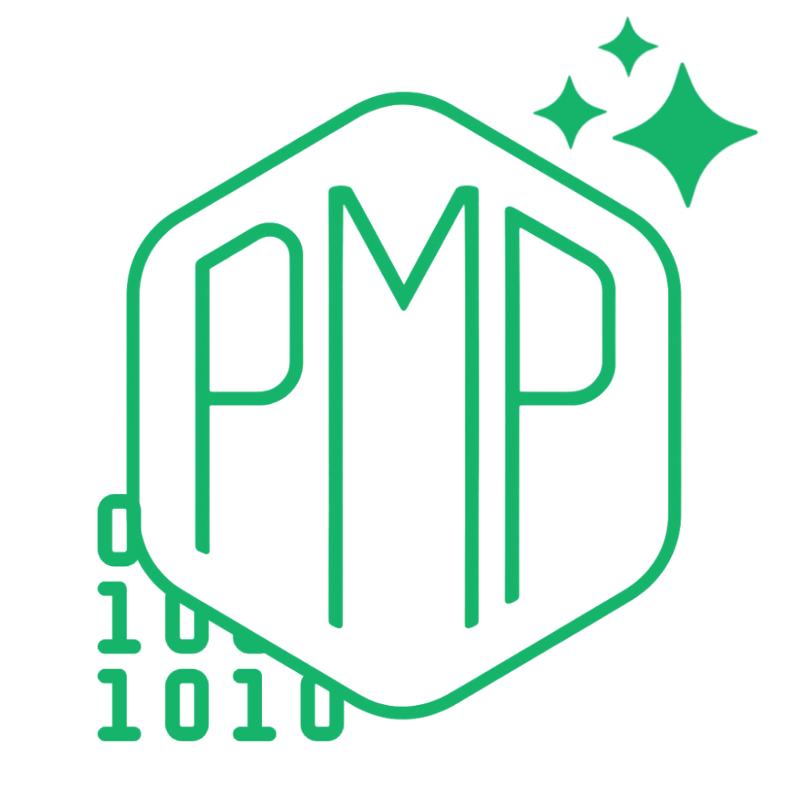

# Prompt My Project (PMP)

[README EN FRANCAIS](/README_FR.md) 

<p align="center">
    
    <p align="center">Command-line tool to generate structured prompts from your source code, optimized for AI assistants.</p>
</p>

<div align="center">
    <a href="https://github.com/benoitpetit/prompt-my-project/blob/main/LICENSE">
        
    </a>
    <a href="https://github.com/benoitpetit/prompt-my-project/releases">
        
    </a>
    <a href="https://opensource.org">
        
    </a>
    <a href="https://github.com/benoitpetit/prompt-my-project/stargazers">
        
    </a>
    <a href="https://golang.org/dl/">
        
    </a>
</div>

## ✨ Features

<div align="center">
    <table>
        <tr>
            <td align="center">📂</td>
            <td><strong>Smart Navigation</strong><br/>Recursively scans your project structure</td>
            <td align="center">🔍</td>
            <td><strong>Binary Detection</strong><br/>Intelligently identifies and avoids binary files</td>
        </tr>
        <tr>
            <td align="center">🎯</td>
            <td><strong>Pattern Matching</strong><br/>Supports advanced inclusion/exclusion patterns</td>
            <td align="center">⚡</td>
            <td><strong>Git-Aware</strong><br/>Respects your project's .gitignore rules</td>
        </tr>
        <tr>
            <td align="center">📊</td>
            <td><strong>Size Control</strong><br/>Flexible file size filtering options</td>
            <td align="center">🚀</td>
            <td><strong>High Performance</strong><br/>Concurrent processing with worker pools</td>
        </tr>
        <tr>
            <td align="center">💾</td>
            <td><strong>Smart Caching</strong><br/>Optimized file content caching</td>
            <td align="center">📝</td>
            <td><strong>Detailed Statistics</strong><br/>Comprehensive metrics about your project</td>
        </tr>
        <tr>
            <td align="center">🔬</td>
            <td><strong>Technology Detection</strong><br/>Automatically identifies used technologies</td>
            <td align="center">🎯</td>
            <td><strong>Key Files Analysis</strong><br/>Identifies most important project files</td>
        </tr>
        <tr>
            <td align="center">⚠️</td>
            <td><strong>Issue Detection</strong><br/>Identifies potential code quality issues</td>
            <td align="center">📊</td>
            <td><strong>Complexity Metrics</strong><br/>Advanced code complexity analysis</td>
        </tr>
        <tr>
            <td align="center">🔄</td>
            <td><strong>Multiple Output Formats</strong><br/>Export as TXT, JSON, or XML with full content</td>
            <td align="center">🔌</td>
            <td><strong>API Integration</strong><br/>Structured formats for programmatic use</td>
        </tr>
    </table>
</div>

## 🧠 Advanced Features

### Binary Detection Cache

PMP maintains a persistent cache of binary file detection results to improve performance:
- Cache stored in `~/.pmp/cache/binary_cache.json`
- Uses file metadata (size, modification time) for cache keys
- Automatically handles cache invalidation
- Falls back to temporary directory if home directory is unavailable

### Smart Token Estimation

The token estimator uses a sophisticated algorithm that:
- Differentiates between code and text content (4 chars/token for code, 5 for text)
- Applies special weights to syntax characters (brackets, newlines, etc.)
- Streams large files to avoid memory issues
- Provides accurate estimates for AI model context limits

### Intelligent Technology Detection

- Automatically identifies programming languages and frameworks
- Uses both file extensions and specific configuration files
- Detects common tools and CI/CD setups
- Provides insights about project stack

### Code Complexity Analysis

Performs advanced static analysis:
- File size and line count distribution
- Directory depth analysis (flags >5 levels deep)
- Code modularity metrics (flags files >100KB)
- Identifies potential maintenance issues (files >500 lines)

### Error Handling

- Automatic retry system for problematic files
- Smart backoff strategy (100ms delay between attempts)
- Size-based retry limits (max 1MB for retry attempts)
- Maximum 3 retry attempts per file
- Graceful degradation for large files

### Performance Optimizations

- Concurrent file processing with worker pools
- Memory-efficient streaming for large files
- Smart caching of file contents and binary detection
- Adaptive file display limits for large directories
- Efficient tree structure generation

## 🔧 Default Configuration

| Parameter      | Value     | Description                  |
| ------------- | --------- | ---------------------------- |
| Min Size      | 1KB       | Minimum file size            |
| Max Size      | 100MB     | Maximum file size            |
| Output Dir    | ./prompts | Output directory for prompts |
| GitIgnore     | true      | Respect .gitignore rules     |
| Workers       | CPU cores | Number of parallel workers   |
| Max Files     | 500       | Maximum number of files      |
| Max Total Size| 10MB      | Maximum total project size   |
| Retry Limit   | 1MB       | Maximum file size for retries|
| Progress Bar  | 40 chars  | Width of progress indicator  |
| Output Format | txt       | Output format (txt/json/xml) |

## 📂 Output Organization

PMP generates a well-structured prompt file that includes:

- Project information and statistics
- Complete file structure visualization
- Formatted file contents
- Token and character count estimates

Prompts are automatically saved in:

- `./prompts/` (default, automatically added to .gitignore)
- Or in the folder specified by `--output`

Files are named using a timestamp format: `prompt_YYYYMMDD_HHMMSS.txt`

## 🎯 Build Artifacts

Format: `pmp_<version>_<os>_<arch>.<ext>`
Example: `pmp_v1.0.0_linux_amd64.tar.gz`

### Supported Architectures

- amd64 (x86_64)
- arm64 (aarch64)

### Supported Systems

- Linux (.tar.gz)
- macOS/Darwin (.tar.gz)
- Windows (.zip)

### Build Process

The build script:
- Automatically detects version from git tags
- Generates binaries for all supported platforms
- Creates compressed archives (.tar.gz for Unix, .zip for Windows)
- Includes README and LICENSE in each archive
- Generates SHA-256 checksums for all artifacts

Build artifacts are placed in the `dist` directory:
```
dist/
├── pmp_v1.0.0_linux_amd64.tar.gz
├── pmp_v1.0.0_linux_arm64.tar.gz
├── pmp_v1.0.0_darwin_amd64.tar.gz
├── pmp_v1.0.0_darwin_arm64.tar.gz
├── pmp_v1.0.0_windows_amd64.zip
├── pmp_v1.0.0_windows_arm64.zip
└── checksums.txt
```

## 🚀 Installation

### macOS & Linux

```bash
curl -fsSL https://raw.githubusercontent.com/benoitpetit/prompt-my-project/refs/heads/master/scripts/install.sh | bash
```

### Windows

```powershell
irm https://raw.githubusercontent.com/benoitpetit/prompt-my-project/refs/heads/master/scripts/install.ps1 | iex
```

## 🗑️ Uninstallation

### macOS & Linux

```bash
curl -fsSL https://raw.githubusercontent.com/benoitpetit/prompt-my-project/refs/heads/master/scripts/remove.sh | bash
```

### Windows

```powershell
irm https://raw.githubusercontent.com/benoitpetit/prompt-my-project/refs/heads/master/scripts/remove.ps1 | iex
```

## 🛠️ Usage

### Basic Syntax

```bash
pmp [options] [path]
```

### Available Options

| Option           | Alias | Description                          | Default |
| ---------------- | ----- | ------------------------------------ | ------- |
| `--include`      | `-i`  | Include only files matching patterns | - |
| `--exclude`      | `-e`  | Exclude files matching patterns      | - |
| `--min-size`     | -     | Minimum file size                    | 1KB |
| `--max-size`     | -     | Maximum file size                    | 100MB |
| `--no-gitignore` | -     | Ignore .gitignore file              | false |
| `--output`       | `-o`  | Output folder for prompt file        | ./prompts |
| `--workers`      | -     | Number of parallel workers           | CPU cores |
| `--max-files`    | -     | Maximum number of files (0 = unlimited) | 500 |
| `--max-total-size` | -   | Maximum total size (0 = unlimited)   | 10MB |
| `--format`       | `-f`  | Output format (txt, json, or xml)    | txt |
| `--help`         | -     | Display help                         | - |
| `--version`      | -     | Display version                      | - |

### Pattern Examples

- `*.go` - All Go files
- `src/` - All files in src directory
- `test/*` - All files in test directory
- `*.{js,ts}` - All JavaScript and TypeScript files
- `!vendor/*` - Exclude all files in vendor directory

### Quick Examples

```bash
# Analyze current directory
pmp .

# Analyze specific project path
pmp /path/to/your/project

# Generate JSON output
pmp . --format json

# Generate XML output
pmp . --format xml

# Filter by file types
pmp . -i "*.go" -i "*.md"

# Exclude test files and vendor directory
pmp . -e "test/*" -e "vendor/*"

# Customize size limits
pmp . --min-size 500B --max-size 1MB

# Control total project size
pmp . --max-total-size 50MB --max-files 1000

# Specify output directory
pmp . -o ~/prompts

# Ignore .gitignore rules
pmp . --no-gitignore

# Adjust worker count
pmp . --workers 4

# Combine multiple options
pmp . -i "*.{js,ts}" -e "node_modules/*" --max-size 500KB -o ./analysis
```

## 🚄 Performance

PMP uses several optimization strategies to maximize performance:

### Concurrent Processing

- Adaptive worker pool based on available CPU cores
- Parallel file processing with efficient memory management
- Real-time progress tracking with refresh rate limiting
- Intelligent error handling with retry mechanism

### Memory Management

- Reusable buffers for file reading
- Large file streaming to avoid memory saturation
- Configurable size limits for individual files and total
- Automatic cleanup of temporary files

### Caching System

- Persistent cache for binary file detection
- File content caching to avoid multiple reads
- Cache keys based on file metadata
- Automatic fallback to temporary cache when needed

### Display Optimizations

- Adaptive limits on displayed files per directory
- Progressive verbosity reduction for large directories
- Optimized progress bar with throttled updates
- Intelligent formatting of durations and sizes

### Limits and Thresholds

- Maximum file size for retries: 1MB
- Delay between retries: 100ms
- Maximum retries: 3
- Maximum size for complexity analysis: 5MB
- Maximum size for line counting: 10MB

## 🔧 Building from source

### Prerequisites

- Go 1.21 or higher
- Git

### Build Steps

```bash
# Clone repository
git clone https://github.com/benoitpetit/prompt-my-project.git
cd prompt-my-project

# Install dependencies
go mod tidy

# Build
./scripts/build.sh

# Run
go run main.go [options] [path]
```

## 🛠️ Advanced Configuration

### CI/CD Integration Example

```yaml
generate_ia_prompt:
  stage: analysis
  image: golang:1.21
  script:
    - curl -sSL https://raw.githubusercontent.com/benoitpetit/prompt-my-project/master/scripts/install.sh | bash
    - pmp --output ./artifacts/prompts
  artifacts:
    paths:
      - ./artifacts/prompts/
```

## ⚙️ Under the Hood

### Concurrent Processing Architecture

- **Worker Pool**: Uses an adaptive worker pool based on available system resources
- **Smart Caching**: File content caching to avoid multiple reads
- **Memory Management**: Use of reusable buffers for file analysis

### Binary File Detection

Combination of three methods for accurate identification:

1. Extension analysis (.png, .exe, ..)
2. MIME type verification
3. Detection of non-text characters

### Advanced Analysis Features

- **Technology Detection**: Automatically identifies programming languages, frameworks, and tools used in your project based on file extensions and specific configuration files.
- **Key Files Analysis**: Identifies the most important files in your project based on:
  - Common important filenames (main.go, index.js, etc.)
  - Location in project structure (root level, src/, etc.)
  - File type and purpose (configuration, documentation, etc.)
- **Code Quality Analysis**: Detects potential issues such as:
  - Large files (>100KB) that might need modularization
  - Long files (>500 lines) that might be hard to maintain
  - Deeply nested directories (>5 levels) suggesting complex structure
- **Complexity Metrics**: Provides advanced code analysis:
  - Total and average lines of code
  - File size distribution and percentiles
  - Extension-based statistics with percentages
  - Technology usage breakdown

### Token Estimation

PMP uses a sophisticated token estimation system that:
- Differentiates between code and text content
- Accounts for special characters and syntax
- Provides accurate token counts for AI model context limits
- Uses efficient streaming for large files

## 📋 Example Prompt Output 

PMP supports three output formats:

### TXT format

```text
PROJECT INFORMATION
-----------------------------------------------------
• Project Name: prompt-my-project
• Generated On: 2025-03-13 22:30:40
• Generated with: Prompt My Project (PMP) v1.0.0
• Host: bigmaster
• OS: linux/amd64

DETECTED TECHNOLOGIES
-----------------------------------------------------
• Go
• Go Modules

KEY FILES
-----------------------------------------------------
These files are likely the most important for understanding the project:
• LICENSE
• README.md
• go.sum
• main.go

POINTS OF INTEREST
-----------------------------------------------------
These elements may deserve special attention during analysis:
• 25.0% of files (1) contain more than 500 lines, which can make the code difficult to maintain

FILE STATISTICS
-----------------------------------------------------
• Total Files: 4
• Total Size: 75 kB
• Avg. File Size: 19 kB
• Total Lines of Code: 2495
• Avg. Lines per File: 623
• Median Lines per File: 352
• 90% of files have fewer than 2078 lines
• Top Extensions by Size:
  - .go: 59 kB
  - .md: 11 kB
  - .sum: 4.0 kB
• File Types:
  - <no-extension>: 1 files (25.0%)
  - .md: 1 files (25.0%)
  - .sum: 1 files (25.0%)
  - .go: 1 files (25.0%)

ANALYSIS SUGGESTIONS
-----------------------------------------------------
When analyzing this project, consider the following approaches:
• For a project using Go, Go Modules, examine the typical patterns and practices of these technologies
• Start by analyzing the identified key files, which likely contain the main logic
• Pay special attention to the identified points of interest, which may reveal problems or opportunities for improvement
• The project contains large files. Look for opportunities for modularization and separation of responsibilities
• Look for design patterns used and evaluate if they are implemented effectively
• Identify potential areas of technical debt or optimization

TOKEN STATISTICS
-----------------------------------------------------
• Estimated Token Count: 23992
• Character Count: 75537

=====================================================

PROJECT STRUCTURE:
-----------------------------------------------------

└── prompt-my-project (4 files)
    ├── LICENSE
    ├── README.md
    ├── go.sum
    └── main.go

FILE CONTENTS:
-----------------------------------------------------

================================================
File: LICENSE
================================================
MIT License

Copyright (c) 2025 [Benoît PETIT]

Permission is hereby granted, free of char....
```

### JSON Format
Structured output in JSON format, perfect for programmatic processing:

```json
{
  "project_info": {
    "name": "my-project",
    "generated_at": "2025-03-13T22:30:40Z",
    "generator": "Prompt My Project (PMP) v1.0.0",
    "host": "hostname",
    "os": "linux/amd64"
  },
  "technologies": ["Go", "Go Modules"],
  "key_files": ["main.go", "README.md"],
  "issues": [
    "25.0% of files (1) contain more than 500 lines, which can make the code difficult to maintain"
  ],
  "statistics": {
    "file_count": 4,
    "total_size": 75000,
    "total_size_human": "75 kB",
    "avg_file_size": 18750,
    "token_count": 23992,
    "char_count": 75537,
    "files_per_second": 12.5
  },
  "file_types": [
    {
      "extension": ".go",
      "count": 1
    },
    {
      "extension": ".md",
      "count": 1
    }
  ],
  "files": [
    {
      "path": "main.go",
      "size": 25000,
      "content": "package main\n\nimport ...",
      "language": "Go"
    },
    {
      "path": "README.md",
      "size": 15000,
      "content": "# My Project\n\nDescription...",
      "language": "Markdown"
    }
  ]
}
```

### XML Format
Structured output in XML format, suitable for integration with XML-based tools:

```xml
<?xml version="1.0" encoding="UTF-8"?>
<project>
  <project_info>
    <name>my-project</name>
    <generated_at>2025-03-13T22:30:40Z</generated_at>
    <generator>Prompt My Project (PMP) v1.0.0</generator>
    <host>hostname</host>
    <os>linux/amd64</os>
  </project_info>
  <technologies>
    <technology>Go</technology>
    <technology>Go Modules</technology>
  </technologies>
  <key_files>
    <file>main.go</file>
    <file>README.md</file>
  </key_files>
  <issues>
    <issue>25.0% of files (1) contain more than 500 lines, which can make the code difficult to maintain</issue>
  </issues>
  <statistics>
    <file_count>4</file_count>
    <total_size>75000</total_size>
    <total_size_human>75 kB</total_size_human>
    <avg_file_size>18750</avg_file_size>
    <token_count>23992</token_count>
    <char_count>75537</char_count>
    <files_per_second>12.5</files_per_second>
  </statistics>
  <file_types>
    <type extension=".go">1</type>
    <type extension=".md">1</type>
  </file_types>
  <files>
    <file>
      <path>main.go</path>
      <size>25000</size>
      <content>package main

import ...</content>
      <language>Go</language>
    </file>
    <file>
      <path>README.md</path>
      <size>15000</size>
      <content># My Project

Description...</content>
      <language>Markdown</language>
    </file>
  </files>
</project>
```

## 🔌 Format Use Cases

Each output format serves different purposes:

### Text Format (TXT)
- **Best for**: Direct use with AI assistants like ChatGPT, Claude, or Gemini
- **Advantages**: Human-readable, well-structured, easy to copy-paste
- **Use when**: You want to quickly analyze a project with an AI assistant

### JSON Format
- **Best for**: Programmatic processing, data extraction, and integration with other tools
- **Advantages**: Easy to parse, structured data, compatible with most programming languages
- **Use when**: Building automation tools, integrating with CI/CD pipelines, or creating custom analysis tools

### XML Format
- **Best for**: Integration with enterprise systems and XML-based tools
- **Advantages**: Hierarchical structure, compatible with XML processing tools
- **Use when**: Working with systems that expect XML input or when using XSLT transformations

### Integration Examples

```bash
# Generate JSON and process with jq
pmp . --format json | jq '.statistics.token_count'

# Generate XML and transform with XSLT
pmp . --format xml > project.xml && xsltproc transform.xslt project.xml > report.html

# Use in CI/CD pipeline
pmp . --format json --output ./artifacts/analysis
```

## 📄 License

This project is licensed under the MIT License - see the [LICENSE](LICENSE) file for details.
