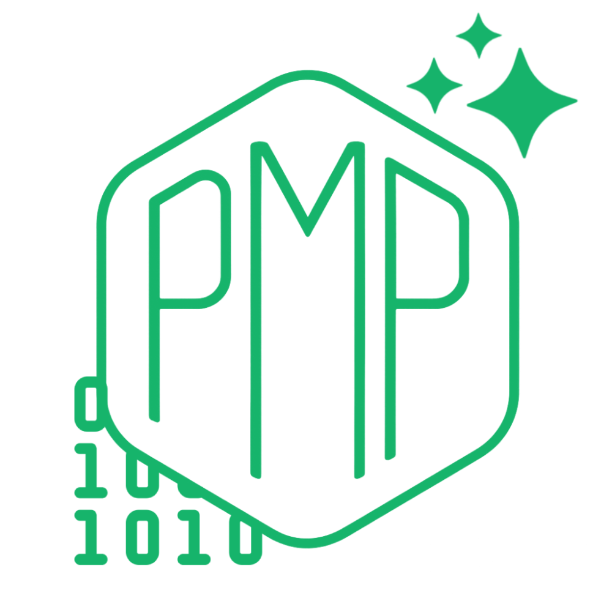

# Prompt My Project (PMP)

[README IN ENGLISH](/README.md) 


<p align="center">
    
    <p align="center">Outil en ligne de commande pour générer des prompts structurés à partir de votre code source, optimisés pour les assistants IA</p>
</p>

<div align="center">
    <a href="https://github.com/benoitpetit/prompt-my-project/blob/main/LICENSE">
        
    </a>
    <a href="https://github.com/benoitpetit/prompt-my-project/releases">
        
    </a>
    <a href="https://opensource.org">
        
    </a>
    <a href="https://github.com/benoitpetit/prompt-my-project/stargazers">
        
    </a>
    <a href="https://golang.org/dl/">
        
    </a>
</div>

## Vue d'ensemble

PMP analyse votre base de code et génère des prompts structurés complets optimisés pour les assistants IA comme ChatGPT, Claude ou Gemini. Il extrait les informations clés, détecte les technologies utilisées et formate la sortie pour maximiser le contexte fourni aux outils d'IA.

## ✨ Fonctionnalités clés

- 📂 **Analyse intelligente de projet** : Analyse récursivement la structure de votre projet avec détection des fichiers binaires et prise en charge de .gitignore
- 🎯 **Filtrage flexible** : Correspondance de motifs avancée pour inclure ou exclure des fichiers et répertoires spécifiques
- 📊 **Statistiques complètes** : Nombre de fichiers, distribution des tailles et estimation des tokens pour les modèles d'IA
- 🔬 **Détection de technologies** : Identifie automatiquement les langages de programmation et frameworks utilisés
- 📝 **Formats de sortie multiples** : Export en TXT, JSON ou XML avec informations détaillées sur le projet
- 🚀 **Haute performance** : Traitement concurrent avec mise en cache intelligente et gestion de la mémoire

## ✨ Fonctionnalités

<div align="center">
    <table>
        <tr>
            <td align="center">📂</td>
            <td><strong>Navigation Intelligente</strong><br/>Analyse récursivement la structure de votre projet</td>
            <td align="center">🔍</td>
            <td><strong>Détection des Binaires</strong><br/>Identifie et évite intelligemment les fichiers binaires</td>
        </tr>
        <tr>
            <td align="center">🎯</td>
            <td><strong>Filtrage par Motifs</strong><br/>Prend en charge les motifs avancés d'inclusion/exclusion</td>
            <td align="center">⚡</td>
            <td><strong>Compatible Git</strong><br/>Respecte les règles .gitignore de votre projet</td>
        </tr>
        <tr>
            <td align="center">📊</td>
            <td><strong>Contrôle de Taille</strong><br/>Options flexibles de filtrage par taille de fichier</td>
            <td align="center">🚀</td>
            <td><strong>Haute Performance</strong><br/>Traitement concurrent avec pools de workers</td>
        </tr>
        <tr>
            <td align="center">💾</td>
            <td><strong>Mise en Cache Intelligente</strong><br/>Mise en cache optimisée du contenu des fichiers</td>
            <td align="center">📝</td>
            <td><strong>Statistiques Détaillées</strong><br/>Métriques complètes sur votre projet</td>
        </tr>
        <tr>
            <td align="center">🔬</td>
            <td><strong>Détection de Technologies</strong><br/>Identifie automatiquement les technologies utilisées</td>
            <td align="center">🎯</td>
            <td><strong>Analyse des Fichiers Clés</strong><br/>Identifie les fichiers les plus importants du projet</td>
        </tr>
        <tr>
            <td align="center">⚠️</td>
            <td><strong>Détection de Problèmes</strong><br/>Identifie les problèmes potentiels de qualité du code</td>
            <td align="center">📊</td>
            <td><strong>Métriques de Complexité</strong><br/>Analyse avancée de la complexité du code</td>
        </tr>
        <tr>
            <td align="center">🔄</td>
            <td><strong>Formats de Sortie Multiples</strong><br/>Export en TXT, JSON ou XML avec contenu complet</td>
            <td align="center">🔌</td>
            <td><strong>Intégration API</strong><br/>Formats structurés pour usage programmatique</td>
        </tr>
    </table>
</div>

## 🧠 Fonctionnalités Avancées

### Cache de Détection des Binaires

PMP maintient un cache persistant des résultats de détection de fichiers binaires pour améliorer les performances :
- Cache stocké dans `~/.pmp/cache/binary_cache.json`
- Utilise les métadonnées des fichiers (taille, heure de modification) comme clés de cache
- Gère automatiquement l'invalidation du cache
- Utilise un répertoire temporaire si le répertoire personnel n'est pas disponible

### Estimation Intelligente des Tokens

L'estimateur de tokens utilise un algorithme sophistiqué qui :
- Différencie le contenu code et texte (4 caractères/token pour le code, 5 pour le texte)
- Applique des poids spéciaux aux caractères de syntaxe (accolades, sauts de ligne, etc.)
- Traite les grands fichiers en streaming pour éviter les problèmes de mémoire
- Fournit des estimations précises pour les limites de contexte des modèles IA

### Détection Intelligente des Technologies

- Identifie automatiquement les langages de programmation et frameworks
- Utilise à la fois les extensions de fichiers et les fichiers de configuration spécifiques
- Détecte les outils courants et les configurations CI/CD
- Fournit des informations sur la stack technologique du projet

### Analyse de Complexité du Code

Effectue une analyse statique avancée :
- Distribution de la taille des fichiers et du nombre de lignes
- Analyse de la profondeur des répertoires (signale >5 niveaux de profondeur)
- Métriques de modularité du code (signale les fichiers >100KB)
- Identifie les problèmes potentiels de maintenance (fichiers >500 lignes)

### Gestion des Erreurs

- Système de réessai automatique pour les fichiers problématiques
- Stratégie de backoff intelligente (délai de 100ms entre les tentatives)
- Limites de réessai basées sur la taille (max 1MB pour les tentatives de réessai)
- Maximum 3 tentatives de réessai par fichier
- Dégradation gracieuse pour les gros fichiers

### Optimisations de Performance

- Traitement concurrent des fichiers avec pools de workers
- Streaming efficace en mémoire pour les gros fichiers
- Mise en cache intelligente du contenu des fichiers et de la détection des binaires
- Limites d'affichage adaptatives pour les grands répertoires
- Génération efficace de la structure arborescente

## 🔧 Configuration par Défaut

| Paramètre      | Valeur    | Description                  |
| ------------- | --------- | ---------------------------- |
| Taille Min    | 1KB       | Taille minimale des fichiers |
| Taille Max    | 100MB     | Taille maximale des fichiers |
| Dossier Sortie| ./prompts | Répertoire de sortie pour les prompts |
| GitIgnore     | true      | Respecter les règles .gitignore |
| Workers       | Cœurs CPU | Nombre de workers parallèles |
| Max Fichiers  | 500       | Nombre maximum de fichiers   |
| Taille Totale Max| 10MB   | Taille totale maximale du projet |
| Limite Réessai| 1MB       | Taille maximale pour les réessais |
| Barre Progrès | 40 chars  | Largeur de l'indicateur de progression |
| Format Sortie | txt       | Format de sortie (txt/json/xml) |

## 📂 Organisation de la Sortie

PMP génère un fichier de prompt bien structuré qui inclut :

- Informations et statistiques du projet
- Visualisation complète de la structure des fichiers
- Contenu formaté des fichiers
- Estimations du nombre de tokens et de caractères

Les prompts sont automatiquement sauvegardés dans :

- `./prompts/` (par défaut, automatiquement ajouté au .gitignore)
- Ou dans le dossier spécifié par `--output`

Les fichiers sont nommés selon un format horodaté : `prompt_YYYYMMDD_HHMMSS.txt`

## 🎯 Artefacts de Build

Format : `pmp_<version>_<os>_<arch>.<ext>`
Exemple : `pmp_v1.0.0_linux_amd64.tar.gz`

### Architectures Supportées

- amd64 (x86_64)
- arm64 (aarch64)

### Systèmes Supportés

- Linux (.tar.gz)
- macOS/Darwin (.tar.gz)
- Windows (.zip)

### Processus de Build

Le script de build :
- Détecte automatiquement la version à partir des tags git
- Génère des binaires pour toutes les plateformes supportées
- Crée des archives compressées (.tar.gz pour Unix, .zip pour Windows)
- Inclut README et LICENSE dans chaque archive
- Génère des checksums SHA-256 pour tous les artefacts

Les artefacts de build sont placés dans le répertoire `dist` :
```
dist/
├── pmp_v1.0.0_linux_amd64.tar.gz
├── pmp_v1.0.0_linux_arm64.tar.gz
├── pmp_v1.0.0_darwin_amd64.tar.gz
├── pmp_v1.0.0_darwin_arm64.tar.gz
├── pmp_v1.0.0_windows_amd64.zip
├── pmp_v1.0.0_windows_arm64.zip
└── checksums.txt
```

## 🚀 Installation

### Utilisation de Go Install (Nouveau !)

La méthode la plus simple si vous avez Go installé :

```bash
go install github.com/benoitpetit/prompt-my-project@latest
```

### Installation par script

#### macOS & Linux
```bash
curl -fsSL https://raw.githubusercontent.com/benoitpetit/prompt-my-project/master/scripts/install.sh | bash
```

#### Windows
```powershell
irm https://raw.githubusercontent.com/benoitpetit/prompt-my-project/master/scripts/install.ps1 | iex
```

### Installation manuelle

1. Téléchargez la dernière version depuis [GitHub Releases](https://github.com/benoitpetit/prompt-my-project/releases)
2. Extrayez l'archive
3. Déplacez le binaire vers un emplacement dans votre PATH

## 🗑️ Désinstallation

### macOS & Linux
```bash
curl -fsSL https://raw.githubusercontent.com/benoitpetit/prompt-my-project/master/scripts/remove.sh | bash
```

### Windows
```powershell
irm https://raw.githubusercontent.com/benoitpetit/prompt-my-project/master/scripts/remove.ps1 | iex
```

## 🛠️ Utilisation

### Syntaxe de base

```bash
pmp [options] [chemin]
```

### Commandes courantes

```bash
# Analyser le répertoire courant
pmp .

# Analyser un projet spécifique
pmp /chemin/vers/projet

# Inclure uniquement des types de fichiers spécifiques
pmp . -i "*.go" -i "*.md"

# Exclure les fichiers de test et le répertoire vendor
pmp . -e "test/*" -e "vendor/*"

# Générer une sortie JSON
pmp . --format json

# Spécifier le répertoire de sortie
pmp . -o ~/prompts
```

### Options disponibles

| Option           | Alias | Description                          | Défaut |
| ---------------- | ----- | ------------------------------------ | ------- |
| `--include`      | `-i`  | Inclure uniquement les fichiers correspondant aux motifs | - |
| `--exclude`      | `-e`  | Exclure les fichiers correspondant aux motifs      | - |
| `--min-size`     | -     | Taille minimale des fichiers                    | 1KB |
| `--max-size`     | -     | Taille maximale des fichiers                    | 100MB |
| `--no-gitignore` | -     | Ignorer le fichier .gitignore              | false |
| `--output`       | `-o`  | Dossier de sortie pour le fichier de prompt        | ./prompts |
| `--workers`      | -     | Nombre de workers parallèles           | Nombre de CPU |
| `--max-files`    | -     | Nombre maximum de fichiers              | 500 |
| `--max-total-size` | -   | Taille totale maximale                   | 10MB |
| `--format`       | `-f`  | Format de sortie (txt, json, ou xml)    | txt |
| `--help`         | -     | Afficher l'aide                         | - |
| `--version`      | -     | Afficher la version                      | - |

## 📋 Formats de sortie

PMP prend en charge trois formats de sortie, chacun conçu pour des cas d'utilisation différents :

### Format texte (par défaut)
Texte formaté lisible par l'homme, optimisé pour une utilisation directe avec les assistants IA. Inclut la structure du projet, le contenu des fichiers et des statistiques complètes.

### Format JSON
Format de données structurées pour le traitement programmatique et l'intégration avec d'autres outils. Parfait pour les pipelines CI/CD et les outils d'analyse personnalisés.

```bash
pmp . --format json
```

### Format XML
Format hiérarchique pour l'intégration avec les systèmes d'entreprise et les outils basés sur XML.

```bash
pmp . --format xml
```

## 📊 Contenu de la sortie

Le prompt généré comprend :

- Informations et statistiques sur le projet
- Technologies et frameworks détectés
- Fichiers clés pour comprendre le projet
- Visualisation complète de la structure des fichiers
- Contenu des fichiers formaté
- Estimation du nombre de tokens et de caractères
- Métriques de qualité du code et suggestions

## 🧠 Fonctionnalités avancées

- **Détection de binaires** : Identifie et exclut automatiquement les fichiers binaires
- **Estimation intelligente des tokens** : Prédiction précise de l'utilisation des tokens pour les modèles d'IA
- **Détection de technologies** : Identifie les langages de programmation et les frameworks
- **Analyse de complexité du code** : Signale les problèmes potentiels de maintenance
- **Mise en cache intelligente** : Améliore les performances avec une mise en cache intelligente du contenu des fichiers

## 🛠️ Compilation depuis les sources

```bash
# Cloner le dépôt
git clone https://github.com/benoitpetit/prompt-my-project.git
cd prompt-my-project

# Installer les dépendances
go mod tidy

# Compiler
./scripts/build.sh

# Ou compiler directement avec go
go build -o pmp
```

## 📄 Licence

Ce projet est sous licence MIT - voir le fichier [LICENSE](LICENSE) pour plus de détails.
